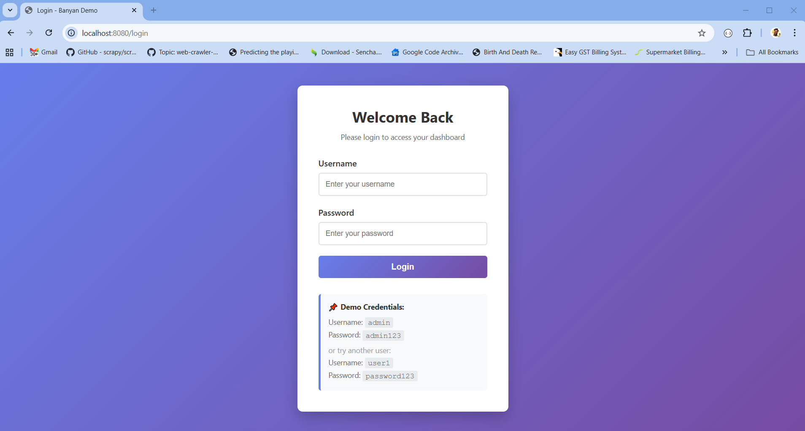
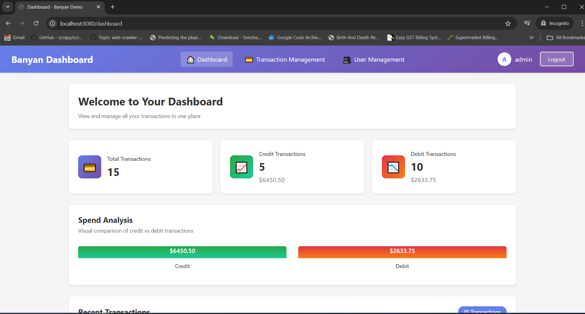
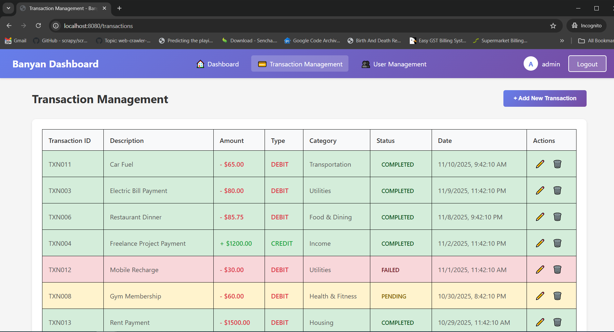
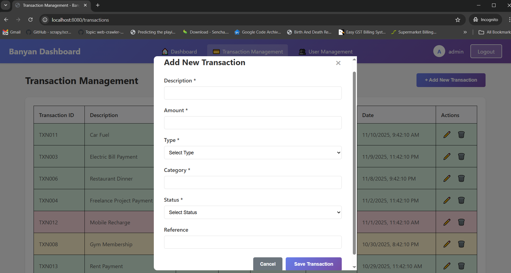
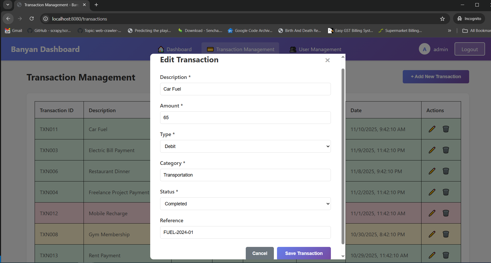
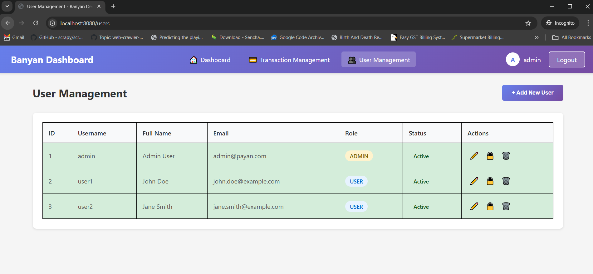
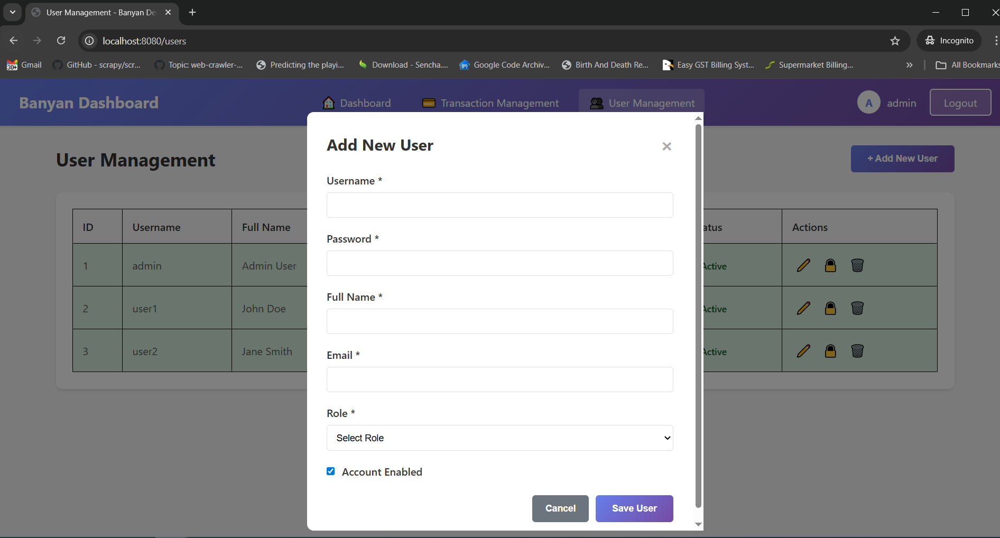
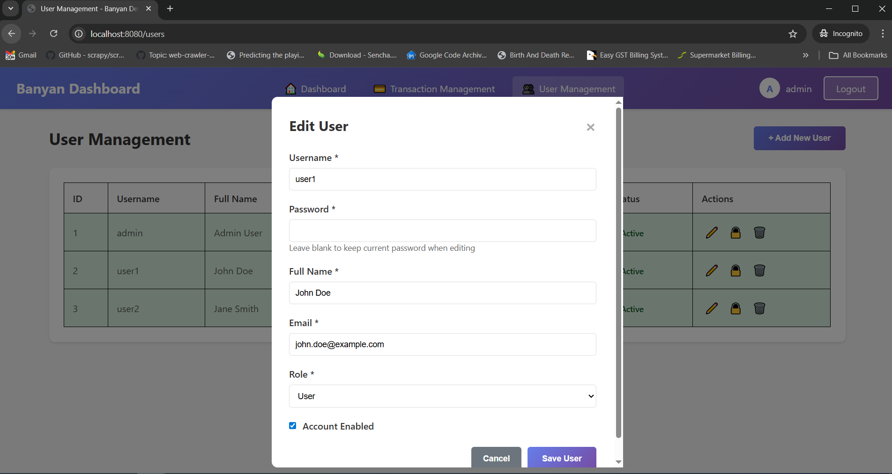

# Payan Demo Task - Spring Boot MVC Application

A complete Spring Boot MVC application with Thymeleaf template engine featuring user authentication and a dashboard with transaction management.

## 🎯 Features

- ✅ User Login & Authentication with Spring Security
- ✅ Dashboard with Transaction Table
- ✅ Responsive UI Design
- ✅ In-memory H2 Database
- ✅ Sample Data Pre-loaded (Users & Transactions)
- ✅ BCrypt Password Encryption
- ✅ Session Management
- ✅ Logout Functionality

## 🛠️ Technologies Used

- **Java 17**
- **Spring Boot 3.2.0**
- **Spring MVC**
- **Spring Security**
- **Spring Data JPA**
- **Thymeleaf Template Engine**
- **H2 In-Memory Database**
- **Maven**
- **Lombok**

## 📋 Prerequisites

- Java JDK 17 or higher
- Maven 3.6 or higher

## 🚀 Getting Started

### 1. Clone the Repository

```bash
git clone https://github.com/hazdik/payan-demo-task.git
cd payan-demo-task
```

### 2. Build the Project

```bash
mvn clean install
```

### 3. Run the Application

```bash
mvn spring-boot:run
```

Or run directly using Java:

```bash
java -jar target/payan-demo-task-1.0.0.jar
```

### 4. Access the Application

- **Login Page**: http://localhost:8080/login
- **Dashboard**: http://localhost:8080/dashboard (after login)
- **H2 Console**: http://localhost:8080/h2-console (for database debugging)

## 📸 Screenshots

### Login Screen


The login page features:
- Clean, modern design with gradient background
- Form fields for username and password
- Demo credentials displayed for easy testing
- Error and success message support
- Responsive layout

### Dashboard Screen


The dashboard displays:
- Professional navigation bar with user information
- Transaction counter badge showing total transactions
- Comprehensive transaction table with:
  - Transaction ID and Description
  - Amount (color-coded: green for credit, red for debit)
  - Transaction Type (CREDIT/DEBIT)
  - Category
  - Status badges (color-coded: completed, pending, failed)
  - Date & Time
  - Reference number
- Logout functionality
- Fully responsive design for all devices

### Transaction Management


The transaction management page features:
- Full CRUD operations for transactions
- List view with all transaction details
- Color-coded rows based on transaction status and type:
  - Green background for completed transactions
  - Yellow background for pending transactions
  - Red background for failed transactions
- Action buttons for each transaction (Edit, Delete)
- Add new transaction button
- Real-time data loading from API

#### Add/Edit Transaction Modal



The transaction modal provides:
- Form to add new transactions or edit existing ones
- Fields for:
  - Description
  - Amount
  - Type (Credit/Debit)
  - Category
  - Status (Pending/Completed/Failed)
  - Reference number
- Form validation
- Save and Cancel actions

### User Management (Admin Only)


The user management page includes:
- Full CRUD operations for users
- List view with user details:
  - User ID
  - Username
  - Full Name
  - Email
  - Role (Admin/User)
  - Account status (Active/Inactive)
- Color-coded rows based on user status:
  - Green background for active users
  - Red background for inactive users
- Action buttons for each user (Edit, Toggle Status, Delete)
- Add new user button
- Role-based badges

#### Add/Edit User Modal



The user modal provides:
- Form to add new users or edit existing ones
- Fields for:
  - Username
  - Password (optional when editing)
  - Full Name
  - Email
  - Role (User/Admin)
  - Account enabled checkbox
- Form validation
- Save and Cancel actions

## 👤 Demo Credentials

### Admin User
- **Username**: `admin`
- **Password**: `admin123`

### Regular Users
- **Username**: `user1` / **Password**: `password123`
- **Username**: `user2` / **Password**: `password123`

## 📊 Sample Data

The application automatically loads sample data on startup:

### Users
- 3 pre-configured users (1 admin, 2 regular users)
- Passwords are encrypted using BCrypt

### Transactions
- 15 sample transactions with different:
  - Types (CREDIT/DEBIT)
  - Statuses (COMPLETED/PENDING/FAILED)
  - Categories (Salary, Food & Dining, Utilities, Shopping, etc.)
  - Amounts ranging from $12.50 to $5000.00

## 🏗️ Project Structure

```
payan-demo-task/
├── src/
│   ├── main/
│   │   ├── java/
│   │   │   └── com/payan/demo/
│   │   │       ├── config/
│   │   │       │   ├── DataLoader.java          # Sample data loader
│   │   │       │   └── SecurityConfig.java      # Spring Security configuration
│   │   │       ├── controller/
│   │   │       │   ├── DashboardController.java # Dashboard controller
│   │   │       │   └── LoginController.java     # Login controller
│   │   │       ├── entity/
│   │   │       │   ├── Transaction.java         # Transaction entity
│   │   │       │   └── User.java                # User entity
│   │   │       ├── repository/
│   │   │       │   ├── TransactionRepository.java
│   │   │       │   └── UserRepository.java
│   │   │       ├── service/
│   │   │       │   ├── CustomUserDetailsService.java
│   │   │       │   └── TransactionService.java
│   │   │       └── PayanDemoApplication.java    # Main application class
│   │   └── resources/
│   │       ├── templates/
│   │       │   ├── dashboard.html               # Dashboard page
│   │       │   └── login.html                   # Login page
│   │       ├── application.properties           # Application configuration
│   │       └── banner.txt                       # Application banner
│   └── test/
└── pom.xml                                       # Maven configuration
```

## 🔐 Security Features

- **Authentication**: Form-based login with Spring Security
- **Password Encryption**: BCrypt password encoder
- **Session Management**: HTTP session-based authentication
- **Authorization**: Role-based access control (ADMIN/USER)
- **CSRF Protection**: Disabled for development (enable in production)

## 📱 User Interface

### Login Page
- Clean, modern design with gradient background
- Form validation
- Error and success message display
- Demo credentials shown for easy testing

### Dashboard
- Professional navigation bar with user info
- Transaction counter badge
- Responsive data table with:
  - Transaction ID
  - Description
  - Amount (colored by type: green for credit, red for debit)
  - Type (CREDIT/DEBIT)
  - Category
  - Status badges (color-coded)
  - Date & Time
  - Reference number
- Logout functionality
- Mobile responsive design

## 🗄️ Database Configuration

The application uses H2 in-memory database with the following configuration:

- **Database URL**: jdbc:h2:mem:payandemo
- **Username**: sa
- **Password**: (empty)
- **H2 Console**: Enabled at http://localhost:8080/h2-console

## 📝 API Endpoints

- `GET /` - Redirects to dashboard
- `GET /login` - Login page
- `POST /login` - Process login
- `GET /dashboard` - Dashboard with transactions (requires authentication)
- `GET /logout` - Logout and redirect to login

## 🎨 Customization

### Modifying Transaction Data

Edit `src/main/java/com/payan/demo/config/DataLoader.java` to customize sample transactions.

### Changing UI Styles

Edit the embedded CSS in:
- `src/main/resources/templates/login.html`
- `src/main/resources/templates/dashboard.html`

### Database Configuration

Modify `src/main/resources/application.properties` to use a different database (MySQL, PostgreSQL, etc.)

## 🧪 Testing

Run the tests using:

```bash
mvn test
```

## 📦 Building for Production

```bash
mvn clean package
```

The executable JAR will be created in the `target/` directory.

## 🐛 Troubleshooting

### Port Already in Use
If port 8080 is already in use, change it in `application.properties`:
```properties
server.port=8081
```

### Database Issues
Check the H2 console at http://localhost:8080/h2-console with JDBC URL: `jdbc:h2:mem:payandemo`

## 📄 License

This project is created for demonstration purposes.

## 👨‍💻 Author

Created as a demo Spring Boot MVC project with Thymeleaf.

## 🙏 Acknowledgments

- Spring Boot Team
- Thymeleaf Team
- H2 Database Team
